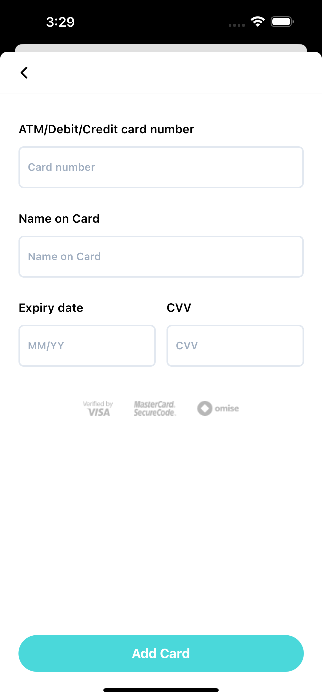

---

# React Native Omise Payment App

Hey there! Welcome to my React Native Omise Payment App, where managing payments and cards is as straightforward as can be. This app allows users like you to securely add and manage your credit/debit cards, view card details, and make payments using the Omise payment gateway.

## Features

- **Add a Card**: Easily add your cards using a simple and secure form. I've implemented strict validation powered by Zod to ensure your data is always safe and correctly formatted.
  
- **View Cards**: Once added, your cards are neatly listed with the last four digits visible for quick identification. No more guessing which card is which!

- **Make Payments**: Ready to pay? Simply select a card and pay a randomly generated amount with confidence. Axios handles all communication with the Omise API, ensuring your transactions are swift and secure.

## Why Zod for Validation?

I chose Zod because it ensures that only valid card and payment data enters my app, keeping my codebase clean and reliable.

## Why Axios for API Calls?

Axios is my go-to for handling API requests because it's straightforward and gets the job done right. Whether I'm fetching card details or processing payments through the Omise API, Axios's robust features ensure my app communicates with the backend seamlessly.

## State Management with React Query

Managing app-wide state and data fetching is where React Query shines. It helps my app stay responsive and up-to-date with real-time updates, simplifying caching and ensuring efficient data management.

## Integration with Latest Omise APIs

I've integrated the latest Omise APIs as per their documentation, ensuring I leverage the newest features and improvements for secure and reliable payment processing.

## Abstraction and Wrapper Benefits

To streamline development and enhance maintainability, I've used abstraction layers and wrappers around critical functionalities like API interactions and state management. This approach allows me to encapsulate complex logic into reusable components, reducing code duplication and making future updates or modifications easier.

## Design Philosophy

My app's design focuses on usability. I've crafted reusable UI components using NativeWind (Tailwind CSS for React Native), ensuring a consistent and responsive experience across different devices. The design is based on the provided Figma file, focusing on user-friendly interactions and intuitive navigation.

## Improvements and Lessons Learned

### Improvement Scope

- **Codebase Cleanup**: I'm continuously refining my codebase to ensure it's clean and maintainable. I'll consolidate redundant logic, refactor components for clarity, and ensure my TypeScript types are accurate.

### Mistake

- **Accidental API Key Commit**: Oops, I had a slip-up and accidentally committed my API keys. I've promptly revoked them and tightened my security measures to prevent any future mishaps. Security is my top priority, and I'm committed to safeguarding your data.

## Built on Expo

This app is built using Expo, making development and deployment easier and more streamlined. It supports Expo Go for quick testing on real devices during development.

---

### Screenshots

